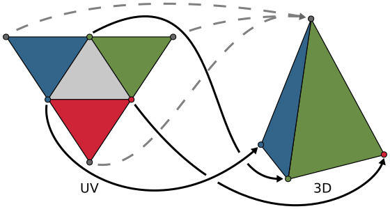
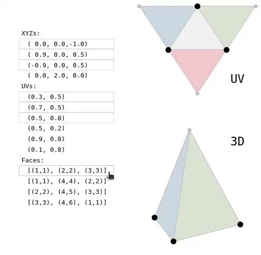
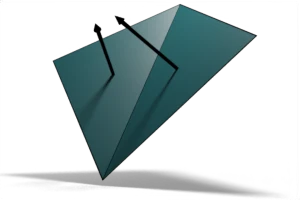

# Year of Unity - November & December: Representing 3D

  

Well this whole Year-of-Unity thing went in an unexpected direction. I'm now creating notes about posts about concepts related to things that show up in Unity, instead of Unity projects themselves! Oh well, at least it's been interesting. This post is actually just a collection of notes about odd discoveries made while creating my previous [YoU](https://github.com/heyoeyo/YoU_07_PLY_to_JSON) entry about interprettying .ply files and rendering the corresponding 3D data.

This repo contains graphical *assets* that were needed to document/explain my notes, as well as interactive *demos*. These are denoted by the folder names in this repo. The demos are all implemented as html files and should 'just work' if you open them directly with a browser, no need for a server or any third-party installs. Like several previous YoU entries, this one ended up being a [write-up on my blog](https://www.litfamiliar.com/posts/repr3d/), where all of the interactive stuff is available directly, without having to download anything from this repo.

## Goals
Rather than exploring anything new, this YoU entry is actually just a follow-up to a previous idea. I had a few ideas I was specifically interested in fleshing out, which are listed below, but there wasn't any new idea or concept that I was hoping to understand this time.

#### Interactively inspecting model data

While I've felt as though I've gained a greater appreciation for how 3D model data is represented as text, I thought it would be cool (and educational!) to be able to select parts of the 3D model text data and have the corresponding UV or 3D render data highlighted. The end result is a little underwhelming to be honest, maybe I could have implemented things differently?

A big part of the problem for me was what felt like an inherent conflict between having complex data that is interesting to inspect, while also having a simple and obvious user interface. Complex model text data just takes up a lot of space, so it's hard to fit all of the information on screen while also displaying the correspondence between text and 3D rendering.

  

I originally wanted to used a cube for all the model data demos, since it seemed so simple, and yet even that turned out to be too messy! Instead, a triangular pyramid was used since it has the [fewest possible vertices/faces](https://en.wikipedia.org/wiki/Simplex) and therefore the smallest text footprint. But the cube is especially interesting, since it immediately breaks a lot of intuition most people would have when discussing the 'real number of vertices' needed to construct the model. A cube has 8 vertices after all, and yet it's possible to argue that it has 14, for example by counting the number of corners (i.e. vertices) on a [paper folding template](https://timvandevall.com/paper-cube-template/). I really wanted to use this as the introduction to my notes on 3D rendering and data representation, but just couldn't figure out how to make everything fit into a user-friendly interactive demo... maybe I'll think of something better in the future.

#### Wiper-comparison between triangle vs quad shading
This one is pretty simple and straightforward. I wanted to have a way of directly comparing the differences between triangular shading versus quad-based shading. I knew from prior experimenting that there was a noticable difference, but manually flipping between images of triangles/quads as well as flat/smooth shading was a bit of a pain. When I was writing up the read-me for the previous YoU entry, I ended up making a [still image](https://github.com/heyoeyo/YoU_07_PLY_to_JSON#smooth-vs-face-vs-triangle-shading) version of this wiper comparison. I really just wanted to make it interactive after that!

#### Rendering & Videos
I had never rendered out a video or even a properly lit still image from [Blender](https://www.blender.org/), or posted a video on my website, and wanted to get a sense of how it all worked. It's another very simple goal, but it's one of those 'first time I tried it' kind of things, where there's a strange satisfaction and maybe even relief when you finally figure things out. One major take-away from all this is the difficulty in rendering videos with transparent backgrounds, mainly due to poor/confusing support in browsers. Meanwhile, rendering transparent images in Blender is easy enough, though the option is hidden under the [Render > Film](https://docs.blender.org/manual/en/latest/render/cycles/render_settings/film.html) settings.

  

